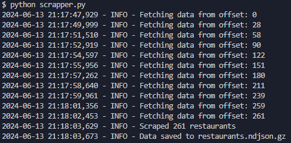

# About this project

This is a python project and it uses all the best practises and industry standards of writing code. It is an assignment project for Anakin that scrapes data of over 250 restaurants in a multithreaded manner.

The key things achieved by me through this project were -

- Webscraping (particularly API scraping)
- Multithreading
- Initially started with proxy with selenium and beautiful soup but switched to better alternatives

# Approach
This was a very new learning experience for me as I never had worked with such things. I initially searched internet on how to scrape data from any particular website. I understood how beautifulsoup could help me achieve this. Then I searched how to use proxy to access the website from some different IP locations. After figuring these things I had this problem of searching a particular address and since it was as easy as changing the URL, I had to read about selenium in order to change the content in the search field and selenium helped me to scroll the website infinitely to achieve the desired number of results. But then ended up solving in a simpler manner by extracting the restaurants using the API which the website was using internally to lazily load the components. I just had to change the offset using a normal loop and hit the API with the correct headersn and payload which I extracted from the website's inspect tool


# Problems faced during this project
- Problem 1 - I wasn't able to visit the website using proxy (free versions)

Solution - I found a code on the internet which tries to check all proxies one by one and gives a result which could help us. This worked for me only once and I had to wait for very long in order to get the one proxy IP which was opening the website. I also tried to open the website mannually by downloading various third party tools but none of them worked for me. I saw for some time I was able to make some calls to the website using my normal network so I utilized that opputunity to access the website

- Problem 2 - I wasn't allowed to type in the search bar

Solution - After I figured out how to use selenium in order to search and what exactly to type in so that I get the desired location, I noticed that I wasn't allowed to type in anything in the search bar now and my script was crashing. So I manually checked on what was the issue and found out that the input box was disabled so I thought of changing the HTML only but then I realized that I don't need the HTML as all the required data was being fetched from the same API endpoint, just with some change in the payload. I figured out this and started to scrape the API instead of the website.


# For running this project follow the below steps

Step 1 - Goto your desired file location and open terminal.


Step 2 - Clone the project here by using the following command
```
git clone https://github.com/Whycodex/AnakinAssignment.git
```


Step 3 - Now change directory from the terminal using the following command
```
cd AnakinAssignment/
```


Step 4 - Open this folder inside a code editor of your choice by using the following command (you can use vs code for it’s extensive features) and make sure to be inside the AnakinAssignment folder
```
code .
```


Step 5 - Now open the terminal and install the dependency by using
```
pip install -r requirements.txt
```


Step 6 - After installing the packages, simply run the following command
```
python scraper.py
```


# Screenshots

